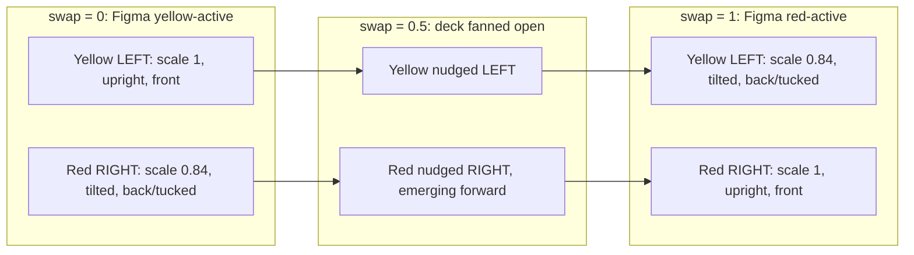

# 🎨 New Card-Stack Visual Design

## Overview

Implement the updated card-stack visuals from Figma ("New Card Designs", node
[42:33](https://www.figma.com/design/ySvpRwUaur9J3Vsf92wBq4/Book-Em?node-id=42-33)).
The full-screen color-fill and bottom card stack stay; the stack's geometry and
motion model change:

- **Yellow is pinned left, red pinned right** — cards no longer cross sides on swap.
- The **active card is larger and near-upright**; the **inactive card is smaller and
  tilted outward**.
- Cards are **bigger and bleed off the bottom edge**.
- The swap **morphs scale + tilt + z**, plus a **transient outward "fan" slide**, between
  the two rest poses (decided), instead of the current translateX cross-over.

Continues on the **`feat/tap-card-to-select` branch** (decided), since it reworks the
very geometry the per-card tap targets ride on.

> Decisions: (1) morph by scale/tilt; (2) **add a transient outward fan** so the
> promoted card reads as pulled out from behind the other (fan open mid-swap, settle
> at the Figma rest position — neither card crosses the centerline); (3) the off-frame
> "Book 'Em" text node is a design artifact → **wordmark stays splash-only**; (4) same
> branch, no new branch.

> **Revised after a three-reviewer pass (DHH / Kieran / simplicity).** Headline
> changes: use **`scale`, not width/height** (kills the perf gate and the Card.tsx
> structural refactor); make the splash handoff **correct by construction** via one
> shared resting-geometry source instead of re-tuning magic numbers; **drop `LIFT`**;
> derive red from yellow by symmetry. See "Review corrections" at the end.

## Problem Statement / Motivation

The shipped stack uses two equal-size cards that slide and cross horizontally. The
new design reads as a clearer "the active card rises and grows" gesture with a fixed
left/right identity (yellow left, red right) — easier to parse when flashing a card
across a room.

## The design, precisely (from Figma metadata + renders)

Two rest frames, each 402×874. Each has a "Cards" group (~280×204) near the bottom:

| State | Card | Side | Size (w×h, pt) | Pose | Z |
|---|---|---|---|---|---|
| **Yellow active** (39:63) | Yellow | left | ~161 × 204 | large, near-upright | front |
| | Red | right | ~135 × 170 | small, tilted right | back |
| **Red active** (39:46) | Yellow | left | ~134 × 170 | small, tilted left | back |
| | Red | right | ~162 × 204 | large, near-upright | front |

Derived (symmetric) model:
- **Active card:** ~161×204 (treat as the base box), rotation ≈ near-upright (~±3°), front.
- **Inactive card:** ~135×170 ≈ **0.84× the active**, rotation ≈ tilted out (~±12°), back.
- **Horizontal:** each color anchored to its side via a fixed translateX; sides never swap.
- **Overlap:** ~16pt in the middle → the back card is ~120pt exposed (vs today's ~45pt
  sliver — the redesign inherently improves tap-target size).
- **Vertical:** cards bottom-aligned and **bleed off the bottom edge**.

⚠️ **Exact tokens to confirm from Figma during build** (the `get_design_context`
endpoint timed out): corner radius, stroke width, precise rotation angles, the 0.84
scale ratio, and the bottom-bleed amount. Confirm against nodes 39:63 / 39:46 using
the Figma renders / `figma-design-sync` agent. Baseline today: radius 22 / border 4
([Card.tsx:35-37](Card.tsx)).

## Proposed Solution

Rework the card geometry from a **translateX cross-over** to a **per-side scale/tilt
morph**, anchored about each card's **bottom edge**; position the stack lower so cards
bleed off the bottom; and route the resting position through a **single shared source
of truth** so the splash handoff can't pop. Keep the tap targets + a11y from the
tap-select work intact.

### Animation model (scale morph + outward fan, about the outer-bottom corner)

For `swap` 0→1 (yellow active → red active), interpolate **per card**, each pinned to
its side. The **rest poses (swap=0 and swap=1) are the exact Figma frames**; the fan
is a transient flourish that returns to zero at both ends.



- **Size:** interpolate `scale` between 1.0 (active) and ~0.84 (inactive).
- **Rotation:** interpolate between ~±3° (upright) and ~±12° (tilted out).
- **Pivot — single outer-bottom corner (build hypothesis).** `transformOrigin: 'left
  bottom'` for yellow, `'right bottom'` for red. Scaling about the outer-bottom corner
  makes the card grow toward center with its outer edge fixed and its bottom pinned —
  which is what the Figma scale wants. **Open question to validate against Figma:** the
  *tilt* may want a different pivot than the *scale*. Scale-toward-center wants the
  outer-bottom corner; a fan-style tilt that splays the tops apart can want the
  *inner*-bottom corner. A single `transformOrigin` serves both, so **build the
  single-origin version first and screenshot it against 39:63 / 39:46.** Only if the
  tilt reads wrong, escalate to the one fallback (rotate and scale as separate steps
  with an interposed, scale-dependent translate computed in-worklet) — that's a
  device-verify-then-decide follow-up, not a path to design for up front.
- **Outward fan (the "pulled from behind" motion):** add a **transient** translateX
  that peaks at mid-swap and returns to 0 at each rest pose — yellow arcs outward
  (left, −), red arcs outward (right, +): `interpolate(p, [0, 0.5, 1], [0, ∓FAN, 0])`.
  The stack fans open as one card emerges and comes forward, then closes. `FAN` is a
  small tunable offset (~15–25px, confirm on device). **Bound it** so the inner edges
  don't fully part at mid-swap — the ~16pt rest overlap should shrink toward 0, not go
  negative, or a strip of the (also-animating) background flashes between the cards.
- **Z / elevation:** flip the existing `zIndex` + interactive-gated `elevation` at
  swap=0.5. This is correct on its own terms — at 0.5 the cards are coplanar, the least
  visible moment to flip. (The fan happens to spread them there too, but the flip does
  not depend on the fan, so tuning `FAN` down can't reintroduce a flicker.)
- **Horizontal rest placement:** anchor each card's outer edge to the stack's outer
  edge (yellow left, red right). With outer-bottom origin + scale, the rest poses fall
  out of the scale; no per-pose translateX interpolation is needed (only the transient
  fan).
- **Reduce motion:** `swap` snaps to target (existing `App.tsx`/splash branches —
  unchanged, since everything is `swap`-driven; the fan collapses to 0 at the target).
- **`LIFT` → `FAN`:** the old vertical lift arc is removed; the horizontal fan arc
  replaces it as the material flourish.

### Why `scale` (not width/height)

`scale` is the compositor path — no per-frame Yoga layout, no perf gate, and it
composes cleanly under the splash's own `scale` transform. The 0.84× inactive card's
4px border renders ~0.6px thinner; imperceptible on a card flashed across a field —
ignore it. Choosing `scale` removes the width/height animation, its 60fps verification
gate, and the Card.tsx structural refactor entirely.

### Single source of truth for the resting pose (the splash fix)

Today two files compute the resting position by unrelated methods and are tuned until
they agree: `App.tsx` uses a `height: 200` slot at `flex-end`; `AnimatedSplash` uses
`restingCenterY = height - (STACK_H - 88) / 2` with a magic `88`
([AnimatedSplash.tsx:44](AnimatedSplash.tsx)). The redesign moves the resting pose, so
instead of re-tuning both:

- Export **one** resting-geometry helper from `CardStack.tsx`:
  `restingCenterY(height, insets)` **returns the stack's center-Y** (the splash uses it
  as `restingCenter − splashCenterY` and `top: splashCenterY − STACK_H/2`, so the
  contract must be center-Y, not a bottom offset). Introduce a **named `BLEED`
  constant** for how far the stack extends past the bottom edge; `STACK_H` is the
  layout box, and the visible extent is `STACK_H − BLEED`. The helper is roughly
  `height − insets.bottom − (STACK_H/2 − BLEED)` — pin the exact form during build.
- `App.tsx` positions the stack from it; `AnimatedSplash` targets the same function.
- **Both must consume `insets` identically** — if the live slot becomes
  `insets.bottom`-relative while the splash stays `height`-relative, they diverge by
  `insets.bottom` and pop on any home-indicator device. One formula, both call sites.
- **Same-parent-box invariant (the real pop risk).** The handoff only holds if the
  splash wrapper and the live-app slot hand `CardStack` the **same width and the same
  bottom datum**. This work changes the live slot to outer-edge/bottom-anchored, but
  `AnimatedSplash`'s wrapper is still `alignItems: 'center'` ([AnimatedSplash.tsx:90,
  123](AnimatedSplash.tsx)). Reconcile them — give both the same parent box — or the
  cards land in different X/Y in splash vs app and pop at handoff. Verify on simulator.

### Changes by file

**`CardStack.tsx`** (the core change)
- Replace `FRONT`/`BACK`/`LIFT` with symmetric pose constants:
  `ACTIVE = { scale: 1, rotate: 3 }`, `INACTIVE = { scale: 0.84, rotate: 12 }`, and a
  transient `FAN` magnitude (~15–25px).
- Anchor each card's **outer edge** to the stack edge (yellow `left: 0`, red
  `right: 0`), with `transformOrigin` at the outer-bottom corner so scaling grows the
  card toward center (Figma-accurate).
- `yellowStyle`: `transformOrigin: 'left bottom'`; interpolate scale 1→0.84, rotate
  −3→−12; translateX fan `interpolate(p,[0,0.5,1],[0,-FAN,0])`; z/elevation flip at 0.5.
- `redStyle`: `transformOrigin: 'right bottom'`; **mirror** (scale 0.84→1, rotate
  +12→+3, fan `[0,+FAN,0]`) — derive from the same constants, don't hand-type a second set.
- Update `STACK_W`/`STACK_H` to the new footprint and lay children out anchored to the
  bottom + their outer side (the current `alignItems/justifyContent: center` no longer
  matches an outer-edge/bottom-anchored model).
- Export the shared `restingCenterY(height, insets)` helper (the fan is transient and
  zero at rest, so it doesn't affect the resting position the splash hands off to).
- Keep `onSelect`/`current`/per-card `onPress`/label/`selected` wiring unchanged.

**`Card.tsx`**
- **Minimal change:** bump the box to the **active** size (~161×204); keep the visual
  styling and the `Pressable`/a11y branch.
- **Drop the absolute self-centering** (`top/left: 50%` + negative margins). Positioning
  is now owned by `CardStack` (each card is anchored to its outer edge + bottom), so a
  self-centering card would fight the stack's anchoring. One owner: the stack positions,
  the card is a dumb box. This is positioning-only — *not* the width/height structural
  refactor that was cut.

**`App.tsx` (`CardScene`)**
- Replace the fixed `height: 200` slot with bottom-anchored positioning derived from
  the shared `restingCenterY(height, insets)` so cards bleed off the bottom. This is
  where the already-imported `useSafeAreaInsets()` finally earns its keep.
- Keep `onSelect={select}` / `current={card}`.

**`AnimatedSplash.tsx`** (handoff must not pop)
- Target the shared `restingCenterY(...)` instead of the magic-`88` formula; update
  the wordmark `top` offset against the new `STACK_H`. `SPLASH_SCALE` likely unchanged.
  The splash already reuses `CardStack`, so it renders the new design automatically.

**`colors.ts`** — no change expected; confirm the Figma palette matches `#FFFF00` /
`#FF0000` / `#363636`.

## User Flows & Edge Cases (spec-flow)

- ✅ Rest states match the two Figma frames (size, side, tilt, overlap).
- ✅ Swap morphs scale+tilt+z + transient outward fan; cards stay on their sides and
  settle exactly at the Figma rest poses; outer edges stay anchored.
- ✅ Reduce-motion → instant pose; haptic still fires.
- ✅ Tap-to-select still works; back card now ~120pt exposed.
- ✅ Splash → app handoff lands on the shared resting geometry with no pop.
- ✅ Responsive across device heights and bottom insets; only **visual** (shadow /
  rounded corner) bleeds — the **touchable** area stays within its parent (Android).
- ✅ Brightness / keep-awake unaffected.

## Acceptance Criteria

- [ ] Yellow-active and red-active rest states match Figma 39:63 / 39:46 (size, side,
      tilt, overlap, radius, stroke) — confirmed against Figma.
- [ ] Swap morphs active↔inactive (grow/straighten ↔ shrink/tilt) about the
      outer-bottom corner; cards pinned to their sides; both rest poses match Figma.
- [ ] The transient outward **fan** reads as the promoted card being pulled out from
      behind and brought forward (fan open mid-swap, settle at Figma rest); neither
      card crosses the centerline; `FAN` tuned to taste on device.
- [ ] z flips cleanly at the midpoint (cards coplanar at 0.5); no visible pop,
      independent of `FAN`.
- [ ] `FAN` is bounded so no background strip flashes between the cards mid-swap.
- [ ] Cards bleed off the bottom; touchable area stays within bounds and respects the
      bottom safe-area inset across iPhone sizes.
- [ ] Per-card tap-to-select intact (haptic, select, a11y label/hint/selected); back
      card reliably tappable even at its ~12° tilt.
- [ ] Splash fly-in hands off with **no pop** (one shared `restingCenterY`; verify on
      simulator).
- [ ] 60fps maintained (scale = compositor path; confirm on device).
- [ ] `tsc --noEmit` clean; matches each file's existing style (no `expo lint`).

## Dependencies & Risks

- **Exact Figma tokens unresolved** (rotation, radius, stroke, scale ratio, bleed) —
  design-context timed out; confirm during build. Estimates here are for structure.
- **Splash handoff** — mitigated by the single shared `restingCenterY`; the residual
  risk is the **same-parent-box invariant** (the splash wrapper is still
  `alignItems: 'center'` while the live slot becomes outer-edge/bottom-anchored).
  Reconcile both to the same parent box, and confirm both consume `insets` identically.
- **`transformOrigin: 'left bottom'` / `'right bottom'` under animation** — supported in
  the Expo 56 RN version, but verify it's honored on the Reanimated UI-thread path
  **on Android specifically** (`transformOrigin` has historically been less reliable
  there than on iOS). The worklet translate-rotate-translate fallback (only if the
  single origin's tilt reads wrong) is **not** a drop-in: the translate amounts depend
  on the live animated scale and must be computed in-worklet.
- **`FAN` gap/wobble tuning** — the fan arc is a 0→peak→0 while rotation is monotonic,
  so the inner-bottom corner traces a small loop; whether that reads as physical or
  wobbly is a device-tuning call. Bound `FAN` so the cards separate-but-still-kiss (no
  background flash).
- **Android bleed vs elevation vs touch** — `elevation` shadows and touch dispatch
  clip to parent bounds on Android. Keep the card's touchable rect inside its parent;
  let only the visual bleed. Interacts with `FRONT_ELEVATION`/`BACK_ELEVATION` touch
  ordering — device-verify.
- **Rotated / mid-swap hit-testing** — RN may hit-test the un-rotated bounding box; at
  ~12° the touch rect and visible card diverge at the corners, and a tap *during* the
  swap lands on the fan-offset, tilted box. Taps normally happen at rest (fan=0), so
  low severity — but verify the back card's exposed area is reliably tappable at rest.

## MVP (pseudo-code)

### CardStack.tsx

```tsx
// Symmetric pose constants (numbers TO CONFIRM from Figma 39:63 / 39:46).
const ACTIVE   = { scale: 1.0,  rotate: 3 };
const INACTIVE = { scale: 0.84, rotate: 12 };
const FAN      = 20; // transient outward slide at mid-swap (tune on device)

const BLEED = 40; // how far the stack extends past the bottom edge (confirm from Figma)

// Shared resting geometry — consumed by App.tsx AND AnimatedSplash (fan is 0 at rest).
// Returns the stack's CENTER-Y (the splash uses restingCenterY - splashCenterY).
export function restingCenterY(height: number, insets: { bottom: number }) {
  return height - insets.bottom - (STACK_H / 2 - BLEED); // pin exact form during build
}

// Yellow: outer edge = LEFT, grows toward center; fans LEFT mid-swap.
const yellowStyle = useAnimatedStyle(() => {
  const p = swap.value;
  return {
    zIndex: p < 0.5 ? 2 : 1,
    elevation: interactive ? (p < 0.5 ? FRONT_ELEVATION : BACK_ELEVATION) : FRONT_ELEVATION,
    transformOrigin: "left bottom",
    transform: [
      { translateX: interpolate(p, [0, 0.5, 1], [0, -FAN, 0]) }, // transient outward fan
      { rotate: `${interpolate(p, [0, 1], [-ACTIVE.rotate, -INACTIVE.rotate])}deg` },
      { scale: interpolate(p, [0, 1], [ACTIVE.scale, INACTIVE.scale]) },
    ],
  };
});
// redStyle: mirror — transformOrigin 'right bottom', fan [0,+FAN,0],
//   rotate +INACTIVE..+ACTIVE, scale 0.84..1, z 1→2
```

### Card.tsx

```tsx
// Only change: box sized to the ACTIVE pose. Centering, visuals, Pressable/a11y kept.
export const CARD_W = 161; // confirm
export const CARD_H = 204; // confirm
```

### App.tsx (CardScene)

```tsx
const insets = useSafeAreaInsets();
const { height } = useWindowDimensions();
// Position the stack so its CENTER sits at the shared restingCenterY → matches splash.
<View style={styles.scene}>
  <View style={{ position: "absolute", top: restingCenterY(height, insets) - STACK_H / 2 }}>
    <CardStack swap={swap} onSelect={select} current={card} />
  </View>
</View>
```

### AnimatedSplash.tsx

```tsx
// Target the shared helper instead of `height - (STACK_H - 88) / 2`.
const restingCenter = restingCenterY(height, insets);
const travel = restingCenter - splashCenterY;
```

## Review corrections (from DHH / Kieran / simplicity pass)

- **Use `scale`, not width/height** — imperceptible ~0.6px border delta (ignore it);
  removes the perf gate and the Card.tsx structural refactor.
- **One shared `restingCenterY`** (returns center-Y; named `BLEED` constant) consumed
  by both `App.tsx` and `AnimatedSplash` with identical `insets` handling — plus the
  **same-parent-box invariant** (reconcile the splash's `alignItems: 'center'` wrapper
  with the live slot's outer-edge anchoring). Deletes the magic `88`/`200`.
- **`scale` about the outer-bottom corner** grows each card toward center. **Single
  origin is the build hypothesis; validate the tilt against Figma** — if it reads
  wrong, the worklet translate-compensation is a follow-up, not a designed-for branch.
- **`LIFT` → transient outward `FAN`** (user refinement): a horizontal fan arc that
  sells "pulled out from behind," settling at the Figma rest poses. It is **decoration,
  not a correctness fix** — the z-flip is correct on its own (coplanar at 0.5); `FAN` is
  bounded so no background strip flashes between the cards.
- **Derive red from yellow** by symmetry.
- **Card.tsx stays a fixed-size box** (bump to active size; keep visuals + a11y) but
  **drops self-centering** — `CardStack` owns positioning, so the two don't fight.
- Remaining on-device watch items: Android `transformOrigin` reliability, bleed-vs-
  elevation-vs-touch, rotated/mid-swap hit-testing, `FAN` gap/wobble tuning.

## References

### Internal
- Card geometry to rework: [CardStack.tsx:13-61](CardStack.tsx)
- Card box (minimal change): [Card.tsx:8-44](Card.tsx)
- Scene slot → bottom anchor: [App.tsx:110-118](App.tsx)
- Splash resting math (the coupling to fix): [AnimatedSplash.tsx:43-45](AnimatedSplash.tsx)
- Palette (unchanged): [colors.ts](colors.ts)
- Predecessor work this stacks on: [docs/plans/2026-06-22-feat-tap-card-to-select-plan.md](docs/plans/2026-06-22-feat-tap-card-to-select-plan.md)

### Design
- Figma "New Card Designs": https://www.figma.com/design/ySvpRwUaur9J3Vsf92wBq4/Book-Em?node-id=42-33
- Yellow-active cards: node 39:63 · Red-active cards: node 39:46

### Conventions
- AGENTS.md: read the versioned Expo v56 docs before writing code.
- Memory: editor lints with Biome (not ESLint); **don't run `expo lint`**; worktrees need their own `npm ci`.
