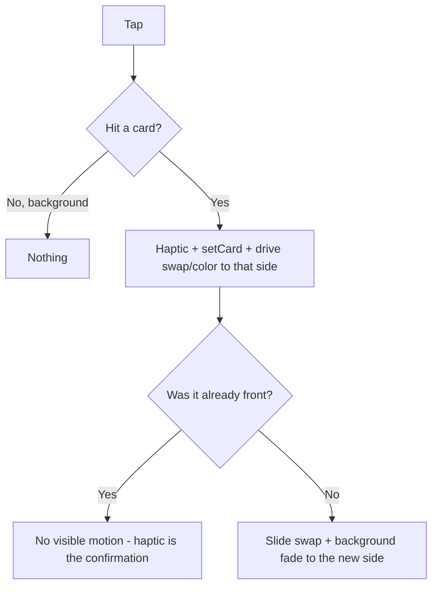

# ✨ Tap a Specific Card to Select It

## Overview

Today the entire card-stack footprint is one `Pressable` that **toggles** between
yellow and red on every tap. This change makes each card **individually tappable**:
tapping a card selects *that* color. Tapping the card that's already in front fires
the medium haptic (its confirmation) but produces no visible change. The colored
background becomes inert — only taps directly on a card switch.

**Scope is functionality only.** The user owns all design/geometry changes (card
sizes, fan-out, exposed tap area). This plan wires the interaction; it does not
restyle the cards.

> This plan was revised after a three-reviewer pass (DHH / Kieran / simplicity).
> Key corrections folded in: **no Reanimated press-pulse** (haptic is the
> confirmation), **`Card.tsx` styles left untouched**, **splash render path kept
> byte-identical**, **resting geometry preserved**, and concrete Android-`elevation`
> + accessibility fixes. See "Review corrections" at the end.

## Problem Statement / Motivation

The original brainstorm chose "tap anywhere to toggle" for a maximum hit target.
We're deliberately moving to a more intentional model: the user points at the
specific card they want to show, like pulling a card from a referee's pocket. The
toggle model can't express "I want red" directly — it only flips. Per-card
selection makes the interaction match the mental model.

## Proposed Solution

1. Replace the stack-wide `toggle()` in `CardScene` (App.tsx) with an **idempotent**
   `select(side)` that always fires the haptic and always drives `swap`/`color` to
   that side's target.
2. Make each card its own touch target by letting `Card` render an
   `AnimatedPressable` **when (and only when) it's given an `onPress`** — so the
   card's existing animated transform is what carries the hit area, and the splash
   (no handler) renders the exact current `Animated.View` tree.
3. Let React Native's existing `zIndex` ordering resolve overlap; on Android, also
   drive `elevation` from `swap` so the front card wins touch there too.
4. Make the background inert — the outer wrapper stays a sizing container (same
   geometry) but is no longer a `Pressable`.
5. Preserve the splash handoff: `CardStack`'s new `onSelect` is **optional** and the
   bottom wrapper keeps its current `height: 200` geometry, so the cards rest in the
   exact same spot the splash flies them to.

### Why idempotent `select` (and why no pulse)

The decided behavior is: tap front card → haptic, no state change; tap back card →
switch. Instead of branching on `side === card` (which introduces a stale-React-state
race on rapid taps and motivates a separate confirmation animation), `select` simply
drives `swap`/`color` to the tapped side's absolute target every time:

- Tap **back** card → spring + fade to the other side (the switch).
- Tap **front** card → spring to the value it's already at = **no visible motion**;
  the medium haptic is the confirmation.

This removes the branch, removes the race, and removes the need for any bespoke
press-pulse. (If, on a real device, the front-card tap feels like nothing happened,
the cheapest add is `Pressable`'s built-in `style={({ pressed }) => …}` — one line,
deferred to the user's design pass. Do **not** build a Reanimated `pressScale`.)

## Technical Approach

### Current architecture (for reference)

- `App.tsx` → `CardScene`: owns `card` state + `swap`/`color` shared values +
  `toggle()`. Renders `<Pressable onPress={toggle} style={{height:200}}>` wrapping
  `<CardStack swap={swap} />`. ([App.tsx:85-128](App.tsx)) Note: the imported
  `insets` and `STACK_BOTTOM_GAP` are **not** used in the render — the `height: 200`
  wrapper at `justifyContent: "flex-end"` is what sets the resting position.
- `CardStack.tsx`: presentational; takes `swap`, renders two `<Card>`s with
  `yellowStyle`/`redStyle` animated transforms (incl. `zIndex`). Documented in-code
  as "the single source of truth for card geometry — rendered identically by the app
  and the animated splash." ([CardStack.tsx:24-61](CardStack.tsx))
- `Card.tsx`: presentational box; owns absolute centering + visual styling, takes
  `color` + animated `style`. ([Card.tsx:19-44](Card.tsx))
- `AnimatedSplash.tsx`: renders `<CardStack swap={swap} />` non-interactively. Its
  `restingCenterY = height - (STACK_H - 88) / 2` is hand-calibrated to the live
  app's current resting position. ([AnimatedSplash.tsx:44, 92](AnimatedSplash.tsx))

### Changes

**`App.tsx` — `CardScene`**
- Replace `toggle()` with idempotent `select(side: CardSide)` (see MVP). Always
  haptic; always drive `swap`/`color` to `side === "red" ? 1 : 0`; reduce-motion
  branch unchanged. Keep `setCard(side)` solely to feed accessibility state.
- Replace the outer `<Pressable onPress={toggle} style={{height:200}}>` with a plain
  `<View style={{height:200}}>` (same height — **do not change the resting geometry**)
  wrapping `<CardStack swap={swap} onSelect={select} />`.
- Remove the now-unused dynamic `label` string.

**`CardStack.tsx`**
- Add optional prop `onSelect?: (side: CardSide) => void` (export `CardSide` or use
  `"yellow" | "red"`).
- Pass per-card props down to `Card`: `onPress={onSelect && (() => onSelect("yellow"))}`
  (and `"red"`), an `accessibilityLabel`, and `selected` (for a11y state). When
  `onSelect` is undefined (splash), no `onPress` is passed → cards render exactly as
  today.
- **Android touch fix:** extend `yellowStyle`/`redStyle` so `elevation` tracks the
  same front/back logic as `zIndex` (front card higher). Today both cards have a
  static `elevation: 8` in `Card.tsx`, which leaves Android touch order between them
  undefined; animating elevation alongside zIndex makes the front card win taps on
  Android, not just iOS. (Keep the visual shadow intent intact.)

**`Card.tsx`**
- Keep **all existing styles unchanged** (centering, sizing, border, radius, shadow).
- Make the root element conditional: `const Root = onPress ? AnimatedPressable : Animated.View`
  where `AnimatedPressable = Animated.createAnimatedComponent(Pressable)` (module
  scope). Pass through `onPress`, `accessibilityRole="button"`, `accessibilityLabel`,
  and `accessibilityState={{ selected }}` only when interactive.
- The composed `style` (the animated transform) stays on this single root node, so
  the hit area rides the transform with **no** centering refactor and **no** extra
  view layer. Splash path (no `onPress`) → identical single `Animated.View` node.

### Hit-testing notes

- **Overlap on iOS** comes free from the animated `zIndex` (front=2, back=1). Front
  card wins the overlap; back card owns its exposed area.
- **Overlap on Android** needs the `elevation` change above (equal elevation today =
  undefined order). **Verify on a physical Android device** — the primary risk.
- **Rotation matters.** The cards are rotated (`-7°` front, `9°` back), so the
  exposed-tap geometry is a rotated intersection, not the naive x-offset rectangle.
  The "exposed back card is a narrow sliver" concern is real but its exact shape must
  be confirmed on-device, not computed from widths alone.
- **`hitSlop`** can widen the back card's target, but overlapping slop steals taps
  from the front card and is measured in the rotated local space — use sparingly, if
  at all. Prefer fixing exposure in the design pass over slop hacks.
- **Mid-animation taps** are safe: `select` is idempotent and `withSpring` interrupts
  cleanly. No guard needed.

## User Flows & Edge Cases (spec-flow)



- ✅ Tap back card → switches: slide + background fade + haptic.
- ✅ Tap front card → haptic only; spring re-targets a value already at rest = no visible motion, no background change.
- ✅ Rapid alternating taps → each resolves to an absolute target; spring interrupts gracefully. No stale-state race (no front/back branch).
- ✅ Tap during an in-flight swap → resolves to the tapped side's target.
- ✅ Reduce-motion on → instant `swap`/`color` set, haptic still fires (existing branch preserved; no pulse to suppress).
- ✅ Background tap → inert.
- ✅ Splash overlay → `Card` renders `Animated.View` (no `onPress`); tree + resting geometry byte-identical; handoff unchanged.
- ✅ Screen reader → two `button`s, each with a label and `selected` state so the current card is announced.

## Acceptance Criteria

- [ ] Tapping the back (not-shown) card switches to it with the existing slide +
      background-fade animation and a medium haptic.
- [ ] Tapping the front (shown) card fires the medium haptic with no visible card
      motion and no background change.
- [ ] Tapping the colored background does nothing.
- [ ] Both cards are independently tappable; the front card wins overlap taps and the
      back card registers taps on its exposed area — **verified on physical iOS and
      Android devices** (Android requires the `elevation` change).
- [ ] Reduce-motion path still works (instant switch, haptic fires).
- [ ] **Splash → app handoff is pixel-identical** to today: the `Card` splash render
      path is unchanged and the bottom wrapper keeps `height: 200`. Visually confirm
      the cards do not jump at handoff.
- [ ] Each card exposes `accessibilityRole="button"`, a distinct label, and
      `accessibilityState.selected` reflecting the current front card. VoiceOver /
      TalkBack can select each and announces which is current.
- [ ] No TypeScript / Biome errors (editor lint only — do **not** run `expo lint`).

## Dependencies & Risks

- **Design pass (user-owned):** the fan-out must leave a usably large exposed tap
  area on the back card (aim ≥ 44pt). With the current geometry it's a thin sliver;
  functionality works but feels fiddly until the design exposes more. Flag back to the
  user if needed.
- **Android `elevation`/touch dispatch:** primary technical risk; the `elevation`
  animation is the mitigation, but it must be device-verified. Fallback if Android
  still misbehaves: absolutely-positioned transparent per-card hit layers.
- **`Animated.createAnimatedComponent(Pressable)`:** standard but historically rough.
  De-risk by keeping it a single node (root of `Card`) and verifying press
  registration on-device early. Fallback: plain `Pressable` wrapping an inner
  `Animated.View` that carries the transform (adds a layer — only if needed, and not
  on the splash path).
- **Splash geometry:** treat the resting position as a hard gate. Do not touch
  `Card.tsx` styles, the `height: 200` wrapper, or `AnimatedSplash`'s `restingCenterY`.

## MVP (pseudo-code)

### App.tsx (CardScene)

```tsx
type CardSide = "yellow" | "red";

const select = (side: CardSide) => {
  Haptics.impactAsync(Haptics.ImpactFeedbackStyle.Medium);
  setCard(side); // drives accessibility `selected` only
  const target = side === "red" ? 1 : 0;
  if (reduceMotion) {
    swap.value = target;
    color.value = target;
  } else {
    swap.value = withSpring(target, SWAP_SPRING);
    color.value = withTiming(target, { duration: BG_FADE_MS, easing: BG_EASING });
  }
};

// render: background no longer pressable; wrapper keeps height:200 (resting geometry)
<Animated.View style={[styles.root, backgroundStyle]}>
  <StatusBar style="dark" />
  <View style={styles.scene}>
    <View style={{ height: 200 }}>
      <CardStack swap={swap} onSelect={select} />
    </View>
  </View>
</Animated.View>
```

### CardStack.tsx

```tsx
export function CardStack({
  swap,
  onSelect,
}: {
  swap: SharedValue<number>;
  onSelect?: (side: "yellow" | "red") => void;
}) {
  // yellowStyle / redStyle unchanged EXCEPT: also animate `elevation` with the
  // same front/back logic as zIndex, so Android touch order matches iOS.
  //   elevation: p < 0.5 ? 8 : 4   (front higher)  // for yellow; mirror for red

  return (
    <Animated.View style={styles.stack}>
      <Card
        color={CARD_YELLOW}
        style={yellowStyle}
        onPress={onSelect && (() => onSelect("yellow"))}
        accessibilityLabel="Yellow card"
        selected={/* current front === yellow */}
      />
      <Card
        color={CARD_RED}
        style={redStyle}
        onPress={onSelect && (() => onSelect("red"))}
        accessibilityLabel="Red card"
        selected={/* current front === red */}
      />
    </Animated.View>
  );
}
```

### Card.tsx

```tsx
const AnimatedPressable = Animated.createAnimatedComponent(Pressable);

export function Card({ color, style, onPress, accessibilityLabel, selected }: CardProps) {
  const Root = onPress ? AnimatedPressable : Animated.View; // splash path stays Animated.View
  return (
    <Root
      style={[styles.card, { backgroundColor: color }, style]} // styles UNCHANGED
      onPress={onPress}
      accessibilityRole={onPress ? "button" : undefined}
      accessibilityLabel={onPress ? accessibilityLabel : undefined}
      accessibilityState={onPress ? { selected } : undefined}
    />
  );
}
```

## Review corrections (from DHH / Kieran / simplicity pass)

- **Cut the Reanimated `pressScale` pulse** — the medium haptic is the confirmation;
  idempotent `select` makes the front-card tap a no-visible-motion no-op for free.
- **`Card.tsx` styles untouched** — no centering relocation, no `cardSlot` style. The
  feature only needs the root node to become pressable.
- **Splash render path kept byte-identical** — the splash passes no `onPress`, so
  `Card` renders the same single `Animated.View`; no `disabled` Pressable enters the
  splash tree/a11y.
- **Resting geometry preserved** — keep the `height: 200` wrapper (now a `View`); the
  splash's `restingCenterY` is calibrated to it.
- **Android `elevation` fix** — both cards currently share `elevation: 8`, leaving
  Android touch order undefined; animate elevation with the front/back logic.
- **No front/back branch in `select`** — removes Kieran's stale-`card`-closure race.
- **Restore accessibility state** — `accessibilityState.selected` replaces the old
  dynamic label so screen readers still announce the current card.

## References

### Internal
- Current toggle + scene + load-bearing `height:200`: [App.tsx:85-128](App.tsx)
- Card geometry / animated transforms / shared-source comment: [CardStack.tsx:24-61](CardStack.tsx)
- Card visual box + centering (do not move): [Card.tsx:19-44](Card.tsx)
- Splash resting-position calibration: [AnimatedSplash.tsx:44](AnimatedSplash.tsx), [reuse of CardStack](AnimatedSplash.tsx:92)
- Product origin (tap-anywhere decision being revised): [docs/brainstorms/2026-05-27-soccer-cards-brainstorm.md](docs/brainstorms/2026-05-27-soccer-cards-brainstorm.md)

### Conventions
- AGENTS.md: read the versioned Expo v56 docs before writing code.
- Memory: editor lints with Biome (not ESLint); **don't run `expo lint`**; worktrees need their own `npm ci`.
