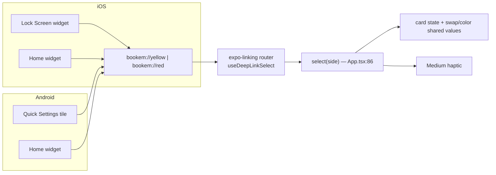

# ✨ Card widgets + lock-screen quick access (iOS + Android)

> Home-screen **yellow** and **red** card widgets on both platforms, plus at
> least one **lock-screen** entry point per phone — all funnelling through one
> deep-link seam into the existing `select(side)`.

## Scope (decided)

This plan was scoped down from an initial "all 7 surfaces" draft after a
three-reviewer pass (DHH / Kieran / simplicity) and a scope decision from the
owner. **v1 ships:**

1. **Deep-link router** (`bookem://yellow|red` → `select`) — pure JS foundation.
2. **iOS widgets** — Home Screen *and* Lock Screen accessory (yellow, red).
3. **Android widgets** — Home Screen (yellow, red).
4. **One lock-screen access path per platform:**
   - iOS: the **Lock Screen accessory widget** above already satisfies this.
   - Android: **Quick Settings tiles** (yellow, red) — the only managed-Expo
     surface reachable over the Android keyguard.

**Deferred to a later plan** (explicitly out of v1): iOS Control Center controls
+ Action button, Android app shortcuts, App Group / "The Book" counter
integration. See [Deferred](#deferred-to-a-later-plan).

**iOS implementation path is now decided: `expo-widgets`** (first-party, SDK 56).
Because Control Center controls are deferred, we don't need `@bacons/apple-targets`
— `expo-widgets` covers Home + Lock Screen accessory widgets in TypeScript/JSX.
(If Control Center is added later, that's when `@bacons/apple-targets` comes in.)

## Overview

Today **Book 'Em** is a single-screen flasher: open the app, tap a card, the
screen turns full-bright yellow or red. This feature adds *external trigger
surfaces* so a referee can summon a specific card without first opening the app
and tapping inside it: home-screen widgets on both phones, plus a lock-screen
entry point on each.

The architecture is one seam. Every surface is "just" another way to deliver
`bookem://yellow` or `bookem://red` to a single `expo-linking` router that calls
the existing [`select(side)`](App.tsx:86). Build that router first (pure JS,
instantly testable), then layer the widgets and the Android tiles on top.

## ⚠️ Reality check — read before building

Two platform constraints shape everything (verified against SDK 56 + Apple /
Android 2026 docs):

1. **Lock-screen taps gate on unlock.** Tapping an iOS Lock Screen widget that
   *opens the app* forces Face ID / passcode **before** the app launches. An
   Android Quick Settings tile that launches an activity on a secured device
   must call `unlockAndRun {}` — the keyguard prompts first. There is **no
   third-party path** to "instant full-screen card from a locked phone" on either
   OS. The in-app card (app already open, brightness pinned) remains the *fastest*
   path; these surfaces are convenience and discoverability for the cold/asleep
   case, **not** a faster locked-screen flash. Say this in the UX/store copy.

2. **Accessory (lock-screen) widgets can't render a full-bleed colored card.**
   They are tiny and tinted/monochrome — yellow vs red **cannot** be conveyed by
   color there. A **glyph + text label is mandatory** (also satisfies colorblind
   accessibility). Home-screen widgets can use color but still need the glyph+label.

3. **Android has no dependable lock-screen *widgets* in 2026** (removed in Android
   5; only OEM-gated partial return in Android 16 QPR2). That's why the Android
   lock-screen path is a **Quick Settings tile**, not a widget.

## Surface matrix (v1)

| # | Surface | Platform | Lock-screen reach | Tap behaviour | Build path | Lift |
|---|---------|----------|-------------------|---------------|-----------|------|
| 1 | Deep-link router (`bookem://yellow|red`) | both | n/a (foundation) | calls `select(side)` | pure JS (`expo-linking`) | S |
| 2 | Home Screen widgets (yellow, red) | iOS | no (home) | `widgetURL` deep-link | `expo-widgets` | M |
| 3 | Lock Screen accessory widgets (yellow, red) | iOS | **yes** (unlock-gated) | `widgetURL` deep-link → unlock → open | `expo-widgets` | M (same target as #2) |
| 4 | Home Screen widgets (yellow, red) | Android | no (home) | `OPEN_URI` deep-link | `react-native-android-widget` | M |
| 5 | Quick Settings tiles (yellow, red) | Android | **yes** (unlock-gated) | `unlockAndRun` → deep-link | custom config plugin + Kotlin `TileService` | M–L |

Surfaces 2+3 are one `expo-widgets` extension. Surface 5 is the one piece of
hand-written native (Kotlin) in v1 — flagged below as the heaviest/riskiest item.

> **Android lock-screen alternative worth weighing before building #5:** an
> ongoing **notification** with Yellow/Red actions (`expo-notifications`, *zero
> native code*) is the most universally lock-screen-visible Android surface. It's
> a different mental model (a persistent "ref mode" notification rather than a
> tap-to-flash tile) but avoids the custom Kotlin plugin entirely. The QS tile is
> the better match for "tap to flash a card" and the 2-tile-per-app limit fits
> yellow+red exactly — so QS tile is the v1 choice, with the notification noted as
> the lighter fallback if the Kotlin plugin proves troublesome.

## Technical approach

### Architecture: the single seam

Everything converges on [`select(side)` in App.tsx:86](App.tsx:86) — today a
closure inside `CardScene` with no external entry point. **Keep `select` local in
`CardScene`** (it already owns `card`, `swap`, `color`, brightness/keep-awake —
lifting state to `App` would scatter that cohesion) and feed it from a small
linking hook. Extract the linking logic into a named hook (e.g.
`useDeepLinkSelect`) rather than inlining it, so cold-start vs warm paths stay
independently testable.



### Foundation — deep-link routing (`expo-linking`, SDK 56)

Pin to https://docs.expo.dev/versions/v56.0.0/sdk/linking/. Scheme is already
`bookem` ([app.json:5](app.json:5)); the prebuilt iOS `AppDelegate.swift` already
wires `RCTLinkingManager`. **No JS handler exists yet** — net-new.

**Cold start is the only hard part, and the naïve approach is wrong.** The
requirement: a `bookem://red` cold start must land on red with **no yellow→red
flash**. The current state initializes to yellow with `swap`/`color` at 0
([App.tsx:75](App.tsx:75), [App.tsx:78-79](App.tsx:78)). An async
`getInitialURL().then(() => select())` inside `useEffect` runs **after** first
paint → it *guarantees* the flash. The fix is a **synchronous read at
initialization** that seeds *both* the `card` state **and** the two shared values
before first paint:

```ts
// App.tsx — inside CardScene (mock)
import * as Linking from "expo-linking";

const ALLOWED: Record<string, CardSide> = { yellow: "yellow", red: "red" };

function cardFromUrl(url: string | null): CardSide | null {
  if (!url) return null;
  const { hostname, path } = Linking.parse(url);
  // GOTCHA (verified): for `bookem://red`, expo-linking puts `red` in HOSTNAME,
  // not path. The exact normalizer below is a SKETCH, not verified — for
  // `bookem://Red/` the trailing slash lands in `path`, not `hostname`, so this
  // `replace` does nothing on the value it's applied to and the `hostname`
  // fall-through is what actually handles it. Write the real normalizer AFTER the
  // Phase 0 measurement task (record actual `Linking.parse` output for every AC3
  // input), don't ship this as-is.
  const key = (hostname ?? path ?? "").toLowerCase().replace(/\/+$/, "");
  return ALLOWED[key] ?? null;
}

// SYNCHRONOUS cold-start read — seeds initial state, no post-paint flash.
const initial = cardFromUrl(Linking.getLinkingURL()) ?? "yellow";
const [card, setCard] = useState<CardSide>(initial);
const swap = useSharedValue(initial === "red" ? 1 : 0);   // was: useSharedValue(0)
const color = useSharedValue(initial === "red" ? 1 : 0);  // was: useSharedValue(0)

// Warm/foreground only — app already alive. Extract as `useDeepLinkSelect(select)`
// that RECEIVES `select` as an argument — `select` is defined below the state init
// (App.tsx:86), so the hook must take it as a param, not close over a hoisted ref.
useEffect(() => {
  const sub = Linking.addEventListener("url", ({ url }) => {
    const side = cardFromUrl(url);
    if (side) select(side);
  });
  return () => sub.remove();
}, []);
```

Must-verify before relying on AC1:
- **`getLinkingURL()` returns synchronously on a real cold start on both
  platforms.** It exists and is documented synchronous in SDK 56, but its
  cold-start reliability isn't spelled out — verify on-device, not in Expo Go
  (Phase 0 needs a dev build anyway). If it ever returns null on cold start,
  fall back to gating first paint, *not* to the post-paint `select`. **That
  fallback is currently named, not designed** — neither `App.tsx` nor
  `AnimatedSplash` has a "not yet painted" state today, so designing it (e.g. hold
  render until the URL resolves) is a Phase 0 task to close before AC1 is checked.
- **The splash does not become the de-facto fix.** `splashDone` starts false, so
  `AnimatedSplash` covers the stack on launch ([App.tsx:131](App.tsx:131)) and
  would *hide* a wrong-card flash — making a broken Phase 0 look like it passes,
  then regress when the splash is shortened. Make the synchronous seed correct
  *independently*; treat the splash cover as belt-and-suspenders.
- **Run `Linking.parse` against every AC3 input and record the real output**
  (`bookem://`, `bookem://red`, `bookem://Red/`, `bookem://red?x=1`,
  `bookem://settings`) before writing the normalizer — measure hostname-vs-path,
  don't reason about it.

Inherited for free (both call `select`): reduced motion
([App.tsx:91](App.tsx:91)) and the Medium haptic. The haptic on every
deep-link select — **including idempotent re-selects** — is correct: it's the
confirmation that an external trigger registered (a QS tile / widget gives even
less feedback than an in-app tap). One open UX nit: a cold-start deep link now
fires a haptic *during launch* — almost certainly desirable (tactile "card
coming") but confirm it doesn't feel jarring under the splash.

### iOS widgets (`expo-widgets`)

Pin to https://docs.expo.dev/versions/v56.0.0/sdk/widgets/.
`npx expo install expo-widgets`; add `"expo-widgets"` to plugins. Author the
widget in TypeScript/JSX via `@expo/ui` with the `'widget'` directive (compiles
to native WidgetKit; not a JS runtime). iOS-only; requires a dev build.

- **Families:** Lock Screen `accessoryCircular` / `accessoryRectangular`
  (iOS 16+) + Home `systemSmall` / `systemMedium` (iPad-only `systemExtraLarge`
  is moot — tablet dropped, [app.json:11](app.json:11)).
- **Two cards:** a yellow and a red widget (or one widget with two variants),
  each a **glyph + label** (mandatory on accessory), tapping `widgetURL`
  (`bookem://yellow` / `bookem://red`).
- **No App Group in v1.** The widgets render *static* glyph+label content — no
  live shared state — so the App Group entitlement is **not** added now. (See the
  resolved contradiction in [Deferred](#deferred-to-a-later-plan): the earlier
  draft both deferred *and* "cheaply added" it; we defer, period — adding an
  unused App Group only invites the EAS provisioning friction it warned about.)
- **EAS:** builds the extension after prebuild; keep `CFBundleVersion` identical
  across app + widget or App Store submission rejects.

### Android home-screen widgets (`react-native-android-widget`)

`npx expo install react-native-android-widget` (verify the resolved version's
peer dep against this project's SDK 56 / RN 0.85 *before* committing to it). Ships
its own Expo config plugin. Build UI in RN primitives (`FlexWidget`/`TextWidget`/
`ImageWidget` → RemoteViews); two widgets (glyph + label), tap via
`clickAction="OPEN_URI"`, `clickActionData={{ uri: "bookem://red" }}`.

### Android Quick Settings tiles (custom config plugin + Kotlin)

The one hand-written-native piece in v1, and the riskiest (no mature library
exists; the one candidate is abandoned). Two `TileService`s ("Yellow Card", "Red
Card") — Android's 2-tiles-per-app limit fits exactly.

```kotlin
// YellowTileService.kt (mock) — onClick()
val pi = PendingIntent.getActivity(this, 0,
    Intent(Intent.ACTION_VIEW, Uri.parse("bookem://yellow"))
        .addFlags(Intent.FLAG_ACTIVITY_NEW_TASK),
    PendingIntent.FLAG_IMMUTABLE)
if (isSecure) unlockAndRun { startActivityAndCollapse(pi) }  // keyguard first
else startActivityAndCollapse(pi)
```

Build via a custom config plugin that injects two `<service>` entries
(`BIND_QUICK_SETTINGS_TILE` permission, `QS_TILE` intent-filter, two icons) plus
the Kotlin files. Gotchas to nail at build time:
- **`startActivityAndCollapse(PendingIntent)`** is the current overload; the
  `Intent` overload is deprecated API 34+. Pin against the project's `compileSdk`.
- **`showWhenLocked`** — this app has a single Expo `MainActivity`. Marking the
  *whole* activity `android:showWhenLocked="true"` changes behavior for **every**
  launch, not just tile launches (the app would draw over the keyguard on all
  cold launches). Decide deliberately whether that's wanted or whether a separate
  trampoline activity is warranted.
- Both tiles must be addable from the QS edit tray with distinct icons/labels;
  dropped-action-on-failed-unlock is acceptable and documented.

### EAS Build & native regeneration

`/ios` and `/android` are **gitignored generated folders** (`.gitignore:38-40`).
**All** native targets (iOS widget extension, Android tiles, Android widget) must
be introduced via **config plugins** so a clean `npx expo prebuild` regenerates
them; nothing may be hand-edited in `ios/`. EAS builds whatever prebuild produces.
Conventions ([AGENTS.md](AGENTS.md), README, memory): pin Expo APIs to **SDK
v56**; format/lint with **Biome, never `expo lint`**; each git worktree needs its
own `npm ci`; use a **dev build** (Expo Go won't run native targets or the custom
scheme reliably).

## Implementation phases

### Phase 0 — Deep-link router (pure JS) — *ships value alone, do first* — ✅ implemented (on-device verify pending)
- [x] `useDeepLinkSelect` hook in `CardScene` ([App.tsx:108](App.tsx:108) via [cardLink.ts](cardLink.ts)): allowlist `{yellow, red}`, parse `hostname ?? path`, warm-path `addEventListener` → `select`. Subscribes once via a `selectRef` so a re-created `select` closure doesn't churn the listener.
- [x] **Cold-start synchronous seed** of `card` + `swap` + `color` via `getLinkingURL()` ([App.tsx:76-84](App.tsx:76)) — `card` uses the lazy `initialCard` initializer; `swap`/`color` seed from `card` on first render.
- [x] Run `Linking.parse` on all AC3 inputs, **recorded real output** (8 inputs incl. `bookem://red`, `Red/`, `?x=1`, bare, unknown host), normalizer written from the measurement: `(hostname ?? path ?? "").toLowerCase().replace(/\/+$/, "")`. Confirmed `.toLowerCase()` is the workhorse; trailing slash lands in `path` not the chosen value.
- [x] Decided the `getLinkingURL()`-null fallback: rely on synchronous `getLinkingURL()` (documented SDK 56 behavior); the `AnimatedSplash` overlay (`splashDone === false` at launch, [App.tsx:135](App.tsx:135)) already covers the card during the brief cold-start window as belt-and-suspenders. **If on-device testing shows `getLinkingURL()` returns null on a link-launched cold start, the fallback is to additionally `await getInitialURL()` and update `card` before `splashDone` flips** — not implemented now (YAGNI until the race is observed).
- [x] Unknown/malformed URL → no-op fallback, never crashes (`cardFromUrl` guards null + wraps `parse` in try/catch → returns null).
- [ ] **On-device verification** (needs a dev build — `npx expo run:ios` / `run:android`): `npx uri-scheme open bookem://red --ios` and `--android` across cold / warm / app-open-on-other-card; confirm no yellow→red flash on cold start (frame-by-frame recording per AC1).
- **Deliverable:** deep links work end-to-end with zero native targets; also unlocks Siri Shortcuts / the Shortcuts app for free. ACs 1–4, 7, 8 (AC1/AC3 logic verified statically; on-device pending).

### Phase 1 — iOS widgets (`expo-widgets`) — ✅ implemented (native build verify pending)
- [x] Installed `expo-widgets` + `@expo/ui` (~56.0.18); configured the plugin in [app.json](app.json) with two widgets (YellowCardWidget, RedCardWidget). Config validated via `expo config --type introspect` (exit 0; generates target `com.ghanbak.bookem.ExpoWidgetsTarget`).
- [x] Yellow + red widgets ([widgets/YellowCardWidget.tsx](widgets/YellowCardWidget.tsx), [widgets/RedCardWidget.tsx](widgets/RedCardWidget.tsx)): `systemSmall` + `systemMedium` (home) + `accessoryRectangular` (lock screen); whole-tile colour fill + bold "YELLOW"/"RED" label (the monochrome/colourblind differentiator); `widgetURL("bookem://yellow|red")` deep-link.
- [x] **Bug fix (device-found):** widgets rendered "unable to load" because the layout is only written to the shared container when `createWidget()` runs — i.e. when the widget module is **imported**. The earlier "static widgets need no `updateSnapshot`" assumption was wrong. Fixed by registering at app start ([registerWidgets.ios.ts](registerWidgets.ios.ts) imports both widgets + calls `updateSnapshot({})`; [registerWidgets.ts](registerWidgets.ts) is the Android/web no-op via Metro platform resolution, keeping iOS-only imports off Android), called from [App.tsx](App.tsx). Requires a native rebuild to take effect.
- [x] **Correction to earlier "no App Group":** `expo-widgets` *requires* an app group (shared container for layout/timeline storage) and the plugin auto-creates `group.com.ghanbak.bookem` + the EAS `appExtensions` block. This is intrinsic and auto-managed — distinct from the deferred *manual* counter app-group. The EAS App-Group provisioning friction (first build interactive; #40851) now applies to v1; `CFBundleVersion` parity across app + widget still required.
- [ ] **Native build verification** (needs Xcode — `npx expo prebuild -p ios && npx expo run:ios`): widgets appear in the gallery, render yellow/red + label, and tapping opens the app on the right card (lock-screen tap unlocks-then-opens). Skipped `accessoryCircular`/`accessoryInline` (a readable word won't fit a circle / inline is text-only).
- **Deliverable:** iOS home + lock-screen widgets. This is the iOS lock-screen access path.

### Phase 2 — Android home-screen widgets (`react-native-android-widget`) — ✅ implemented (native build verify pending)
- [x] Installed `react-native-android-widget@0.20.3` (peer `expo>=54` → SDK 56 OK). **Needed `--legacy-peer-deps`** (an `@expo/ui` optional `react-dom` peer wants react>19.2.3); added [.npmrc](.npmrc) `legacy-peer-deps=true` so EAS + worktree installs stay reproducible.
- [x] Yellow + red widgets ([widgets/android/CardAndroidWidget.tsx](widgets/android/CardAndroidWidget.tsx)): full colour fill + bold "YELLOW"/"RED" label, `clickAction="OPEN_URI"` → `bookem://yellow|red`, `accessibilityLabel`. Task handler ([widgets/android/widgetTaskHandler.tsx](widgets/android/widgetTaskHandler.tsx)) maps widget name → face; registered in [index.ts](index.ts) guarded to `Platform.OS === "android"`. Plugin configured in [app.json](app.json) (widgets `YellowCard`/`RedCard`).
- [x] Clean `npx expo prebuild --clean` (exit 0, both platforms): generates Android receivers `.widget.YellowCard`/`.widget.RedCard` + provider XMLs, and iOS `ExpoWidgetsTarget/` — **AC10 validated**.
- [ ] **Native build verification**: `npx expo run:android` on a device/emulator; long-press home → add Yellow/Red widget; tap opens the app on the right card.
- **Deliverable:** Android home-screen widgets.

### Phase 3 — Android Quick Settings tiles (lock-screen access) — ✅ implemented (Gradle build verify pending)
- [x] Custom config plugin [plugins/withQuickSettingsTiles.js](plugins/withQuickSettingsTiles.js) (registered in [app.json](app.json)): writes a shared `CardTileService` + `YellowCardTileService`/`RedCardTileService` Kotlin + a monochrome `ic_card_tile` drawable, and injects two `<service>` manifest entries (`QS_TILE` filter + `BIND_QUICK_SETTINGS_TILE` permission + icon/label).
- [x] `onClick` opens `bookem://yellow|red` via `ACTION_VIEW` → routes to `MainActivity` (already has the scheme filter); `isLocked` → `unlockAndRun {}`; `startActivityAndCollapse` overload pinned (PendingIntent on API 34+, deprecated Intent overload below). **`showWhenLocked` decision: NOT set** — taps gate on unlock anyway, so the card shows after unlock without changing every launch.
- [x] `expo prebuild -p android --clean` (exit 0) generates both tiles + manifest entries with distinct labels (Yellow Card / Red Card), shared card-glyph icon.
- [ ] **Gradle build verification** (`npx expo run:android`): add each tile from the QS edit tray; pull the shade over the keyguard → tap → unlock → app opens on the right card.
- **Deliverable:** Android lock-screen access. *(Fallback if the Kotlin plugin regresses: the `expo-notifications` Yellow/Red action notification — zero native code.)*

### Phase 4 — Polish, accessibility
- [ ] VoiceOver / TalkBack labels on every surface ("Flash yellow card").
- [ ] Glyph legibility + colorblind audit across all sizes (incl. monochrome accessory).
- [ ] Update README (new surfaces, dev-build requirement, the unlock-gate expectation); add a `docs/solutions/` learnings entry (none exists yet).

## Acceptance criteria

### Functional
- [ ] **AC1 — Cold start:** launching via `bookem://red` lands on red with **no yellow→red flash** and no splash-default override. *(Satisfied only by the synchronous seed of `card` + both shared values — not the async mock.)*
- [ ] **AC2 — Single seam:** deep-link path and on-screen-tap path both call `select` → identical animation/haptic behaviour.
- [ ] **AC3 — Bad URL:** `bookem://`, `bookem://xyz`, `bookem://Red/`, `?x=1` → defined no-op, never crashes. Grammar documented (case-insensitive, trailing-slash-tolerant, host `yellow|red`) — *backed by recorded `Linking.parse` output*.
- [ ] **AC4 — Repeats:** rapid yellow→red is safe (Reanimated re-targets cleanly — add one explicit test case); tap-same-card-again keeps the idempotent flash + haptic.
- [ ] **AC5 — Surfaces present:** iOS home + lock-screen widgets (yellow, red); Android home widgets (yellow, red); Android QS tiles (yellow, red) — all deep-link correctly, tested **locked + unlocked**.
- [ ] **AC6 — Lock gate:** iOS lock-screen widget + Android QS tile dropped-action-on-failed-unlock is acceptable and documented.

### Non-functional
- [ ] **AC7 — Brightness:** after a **warm** deep link, brightness is pinned (verify; `select` doesn't touch brightness, `pin()` runs on `AppState "active"` — confirm no un-pinned end state rather than chasing a hypothetical race).
- [ ] **AC8 — Reduced motion:** honoured on every entry path.
- [ ] **AC9 — Accessibility:** glyph + text label on every surface; VoiceOver/TalkBack labels; 44pt min targets.
- [ ] **AC10 — Reproducible prebuild:** clean `npx expo prebuild` regenerates **all** native targets and a second consecutive prebuild is idempotent; EAS builds them; `CFBundleVersion` parity (iOS).
- [ ] **AC11 — Tooling:** Biome clean; no `expo lint`; pinned to SDK v56 APIs.

### Quality gates
- [ ] Manual matrix passed on a **physical** iOS device (lock-screen widget) and a **physical** Android device (QS tile over keyguard) — emulators don't reproduce keyguard behavior reliably.
- [ ] README updated; `docs/solutions/` learnings entry created.

## Open decisions

**Resolved by the scope decision:**
- iOS path → **`expo-widgets`** (Control Center deferred, so `@bacons/apple-targets` not needed in v1).
- App Group → **not added in v1** (widgets are static; defer to "The Book").

**Still open (have defaults, confirm before the dependent phase):**
1. **Android lock-screen mechanism:** Quick Settings tile (default — matches "tap
   to flash", 2-per-app fits) vs ongoing notification (`expo-notifications`, zero
   native code). Confirm before Phase 3.
2. **`showWhenLocked` strategy** (Phase 3): mark the single `MainActivity` (affects
   all launches) vs a dedicated trampoline activity.
3. **Cold-start haptic** (Phase 0): keep the launch-time Medium haptic (default —
   tactile confirmation) or suppress it during cold start.
4. **Main card colorblind glyph:** the in-app full-screen card relies on color
   alone ([CardStack.tsx](CardStack.tsx)) while we *mandate* glyphs on widgets.
   Logged inconsistency — default: out of scope, future a11y pass.

## Risks & mitigation

| Risk | Likelihood | Impact | Mitigation |
|------|-----------|--------|-----------|
| **Cold-start yellow flash** (the async-mock trap) | Medium | Low (visual) but it's the headline AC | Synchronous seed of `card` + both shared values (AC1); verify on-device, not under-splash. |
| **Android QS tile = custom Kotlin plugin** (no library) | High | Medium | Smallest possible plugin; on-device keyguard test; `expo-notifications` fallback documented. |
| **`react-native-android-widget` / `expo-widgets` version fit** | Low–Med | Medium | Verify peer deps vs SDK 56 / RN 0.85 before committing each phase. |
| **App Review 4.2 (minimum functionality)** | Medium | High (rejection) | **The Book counter — not widgets — is the real answer to "too simple."** Widgets that deep-link into the one existing action add *entry points*, not *function*; don't lean on them for 4.2. Sequence/keep The Book as the utility story; widgets are compliant under 2.5.16 but won't, alone, clear 4.2. |
| **User expectation: "lock screen isn't instant"** | High | Medium | Set expectations in UX/store copy; the in-app card stays the fast path. |
| **`showWhenLocked` side effect on every launch** | Medium | Medium | Deliberate decision in Phase 3 (Open Decision 2). |

## Success metrics

- iOS widgets (home + lock) and Android widgets + QS tiles functional on physical
  devices.
- Cold-start deep link → correct card with no visible flash (verify via
  frame-by-frame screen recording — that's the measurement for "no flash").
- Zero crashes on malformed URLs.
- App Store + Play review passed (note: utility story rests on the roadmap, not
  the widgets).

## Deferred to a later plan

Explicitly **not** in v1 (cut after review):
- **iOS Control Center controls + Action button** — the best lock-screen-reachable
  iOS surface, but requires `@bacons/apple-targets` (a native target + the
  experimental dep + App Group/EAS provisioning friction). Add as the first
  fast-follow if usage shows the lock-screen case is real. *This is the trigger to
  introduce `@bacons/apple-targets`.*
- **Android app shortcuts** (long-press launcher) — near-free static `shortcuts.xml`,
  but unlocked-launcher only and competes with the app icon. Low ROL for v1.
- **App Group + "The Book" counter integration** — add the App Group entitlement
  *in the PR that needs it* (when a widget must render a live count), not before.
  Avoids the provisioning friction (expo/expo #40851) for an unused entitlement.
- **iOS Live Activities, notification "ref mode", Siri/Assistant** — future surfaces;
  Siri becomes nearly free once App Intents exist (with Control Center).

## References & research

### Internal (code seams)
- Selection seam: [App.tsx:86](App.tsx:86) (`select`); state init [App.tsx:75](App.tsx:75); shared-value init [App.tsx:78-79](App.tsx:78); brightness pin on `active` [App.tsx:59](App.tsx:59); splash gate [App.tsx:131](App.tsx:131).
- Scheme + plugins: [app.json:5](app.json:5) (`bookem`), [app.json:29](app.json:29) (plugins — no native targets yet).
- Tap path the deep link must match: [CardStack.tsx:111](CardStack.tsx:111); color-only cards (Open Decision 4): [CardStack.tsx](CardStack.tsx).
- Shared palette for widget UI: [colors.ts](colors.ts) (`#FFFF00` / `#FF0000`).
- Native folders gitignored: `.gitignore:38-40`; empty entitlements `ios/BookEm/BookEm.entitlements`.
- Conventions: [AGENTS.md](AGENTS.md) (pin Expo v56), README (Biome, worktree `npm ci`).

### External (source URLs)
- Expo SDK 56 docs (pin everything here): https://docs.expo.dev/versions/v56.0.0/
- `expo-widgets` (chosen iOS path): https://docs.expo.dev/versions/v56.0.0/sdk/widgets/
- `expo-linking`: https://docs.expo.dev/versions/v56.0.0/sdk/linking/
- `expo/examples` `with-widgets`: https://github.com/expo/examples/tree/master/with-widgets
- `react-native-android-widget`: https://github.com/sAleksovski/react-native-android-widget
- Android — Quick Settings tiles: https://developer.android.com/develop/ui/views/quicksettings-tiles
- Apple — Widgets HIG: https://developer.apple.com/design/human-interface-guidelines/widgets
- Apple — App Review Guidelines (2.5.16, 4.2): https://developer.apple.com/app-store/review/guidelines/
- Deferred-path ref — `@bacons/apple-targets` example: https://github.com/EvanBacon/expo-apple-widget-example

### Related work
- Brainstorm (widgets flagged as future): [docs/brainstorms/2026-05-27-soccer-cards-brainstorm.md](docs/brainstorms/2026-05-27-soccer-cards-brainstorm.md)
- Launch plan: [docs/plans/2026-06-15-chore-readme-and-public-store-launch-plan.md](docs/plans/2026-06-15-chore-readme-and-public-store-launch-plan.md)

### AI-era notes
- Researched + reviewed with Claude (repo-research, learnings, framework-docs,
  best-practices, spec-flow, and DHH/Kieran/simplicity reviewers), 2026-06-23.
  Plan scoped down from 7 surfaces to widgets + one lock-screen path per platform
  after review.
- **Test deep links (`uri-scheme open bookem://red`) before building any native
  target** — fastest feedback loop. The Kotlin QS tile and `expo-widgets` target
  are the human-review-heavy parts.
